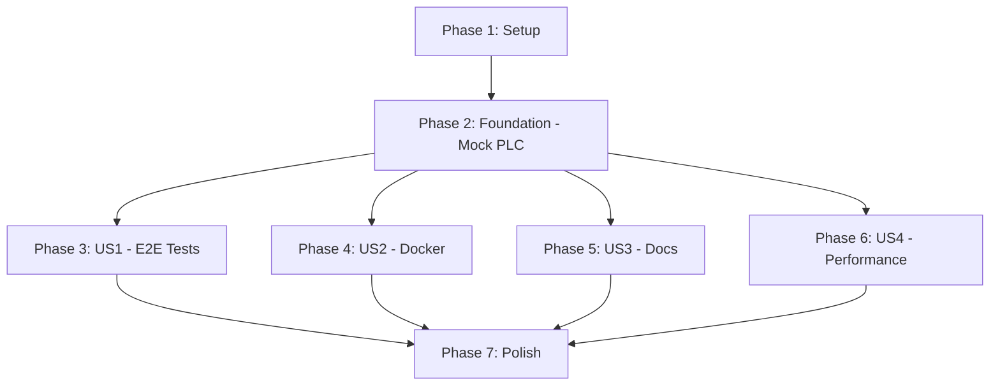

# Tasks: 통합 테스트 및 배포 준비

**Input**: Design documents from `/specs/008-integration-test-deployment/`
**Prerequisites**: plan.md, spec.md, research.md, data-model.md

**Tests**: Feature 8 IS the testing feature - all tasks are test-related

**Organization**: Tasks are grouped by user story to enable independent implementation and testing of each story.

## Format: `[ID] [P?] [Story] Description`

- **[P]**: Can run in parallel (different files, no dependencies)
- **[Story]**: Which user story this task belongs to (e.g., US1, US2, US3, US4)
- Include exact file paths in descriptions

## Path Conventions

- Web app structure: `backend/src/`, `apps/admin/`, `apps/monitor/`
- Tests: `backend/src/scripts/integration_test/`
- Docker files: Root directory
- Docs: `docs/` at repository root

---

## Phase 1: Setup (Test Infrastructure)

**Purpose**: Initialize testing infrastructure and dependencies

- [ ] T001 Install pytest dependencies (pytest 7.4+, pytest-asyncio, pytest-html, pytest-timeout) in backend/requirements.txt
- [ ] T002 [P] Install Locust 2.15+ for load testing in backend/requirements.txt
- [ ] T003 [P] Install memory_profiler 0.61+ and psutil for memory profiling in backend/requirements.txt
- [ ] T004 Create integration test directory structure at backend/src/scripts/integration_test/__init__.py
- [ ] T005 [P] Create pytest.ini configuration file at backend/pytest.ini with test discovery settings
- [ ] T006 [P] Create .dockerignore file at root with exclusion patterns

---

## Phase 2: Foundational (Mock Infrastructure)

**Purpose**: Core mock infrastructure that MUST be complete before ANY user story testing

**⚠️ CRITICAL**: No user story testing can begin until mock PLC server is ready

- [ ] T007 Implement Mock PLC Server base class in backend/src/scripts/integration_test/mock_plc_server.py
- [ ] T008 Add MC 3E ASCII protocol request parser to mock_plc_server.py
- [ ] T009 Add MC 3E ASCII protocol response generator to mock_plc_server.py
- [ ] T010 Add configurable device memory (W, M, D registers) to mock_plc_server.py
- [ ] T011 Add thread-safe concurrent connection handling to mock_plc_server.py
- [ ] T012 Add error simulation modes (timeout, malformed response, connection refused) to mock_plc_server.py
- [ ] T013 Create pytest fixture for starting/stopping mock PLC server in backend/src/scripts/integration_test/conftest.py

**Checkpoint**: Mock PLC infrastructure ready - E2E testing can now begin

---

## Phase 3: User Story 1 - E2E 통합 테스트 (Priority: P1) 🎯 MVP

**Goal**: Validate entire SCADA flow (PLC → Polling → Buffer → Oracle → UI) works end-to-end

**Independent Test**: Run pytest and verify all E2E tests pass with <5 minute execution time

### E2E Test Implementation for User Story 1

- [ ] T014 [P] [US1] Create E2E full flow test in backend/src/scripts/integration_test/test_e2e_full_flow.py
- [ ] T015 [P] [US1] Test PLC connection and data collection in test_e2e_full_flow.py
- [ ] T016 [P] [US1] Test circular buffer push/pull operations in test_e2e_full_flow.py
- [ ] T017 [P] [US1] Test Oracle Writer batch INSERT in test_e2e_full_flow.py (requires mock Oracle or test Oracle DB)
- [ ] T018 [P] [US1] Test Admin UI REST API endpoints in test_e2e_full_flow.py
- [ ] T019 [P] [US1] Test Monitor UI WebSocket data flow in test_e2e_full_flow.py
- [ ] T020 [P] [US1] Verify data consistency (PLC → Oracle → UI) in test_e2e_full_flow.py

- [ ] T021 [P] [US1] Create multi-group isolation test in backend/src/scripts/integration_test/test_multi_group_isolation.py
- [ ] T022 [P] [US1] Test 3 polling groups running simultaneously in test_multi_group_isolation.py
- [ ] T023 [P] [US1] Test one PLC failure doesn't affect other groups in test_multi_group_isolation.py

- [ ] T024 [P] [US1] Create Oracle failover test in backend/src/scripts/integration_test/test_oracle_failover.py
- [ ] T025 [P] [US1] Test circular buffer accumulation when Oracle down in test_oracle_failover.py
- [ ] T026 [P] [US1] Test CSV backup file creation in test_oracle_failover.py
- [ ] T027 [P] [US1] Test data replay after Oracle recovery in test_oracle_failover.py

- [ ] T028 [P] [US1] Create UI integration test in backend/src/scripts/integration_test/test_ui_integration.py
- [ ] T029 [P] [US1] Test Admin UI tag modification and polling restart in test_ui_integration.py
- [ ] T030 [P] [US1] Test Monitor UI WebSocket with 3 concurrent connections in test_ui_integration.py
- [ ] T031 [P] [US1] Test alarm display on Monitor UI in test_ui_integration.py

- [ ] T032 [US1] Create pytest HTML report generator configuration in backend/pytest.ini
- [ ] T033 [US1] Add test execution time limit (5 minutes) using pytest-timeout in backend/pytest.ini
- [ ] T034 [US1] Create test result JSON exporter in backend/src/scripts/integration_test/export_test_results.py

**Checkpoint**: E2E integration tests complete - can verify entire system works end-to-end

---

## Phase 4: User Story 2 - Docker 컨테이너화 (Priority: P2)

**Goal**: Package entire SCADA stack in Docker containers with docker-compose orchestration

**Independent Test**: Run `docker-compose up` and verify all 3 services start within 2 minutes

### Docker Implementation for User Story 2

- [ ] T035 [P] [US2] Create backend Dockerfile with multi-stage build at backend/Dockerfile
- [ ] T036 [P] [US2] Use Alpine base image and optimize layers in backend/Dockerfile
- [ ] T037 [P] [US2] Add non-root user for security in backend/Dockerfile
- [ ] T038 [P] [US2] Create Admin UI Dockerfile at apps/admin/Dockerfile
- [ ] T039 [P] [US2] Create Monitor UI Dockerfile at apps/monitor/Dockerfile

- [ ] T040 [US2] Create docker-compose.yml at root with 3 services (backend, admin, monitor)
- [ ] T041 [US2] Define backend service with ports, volumes, environment in docker-compose.yml
- [ ] T042 [US2] Define admin service with ports and dependencies in docker-compose.yml
- [ ] T043 [US2] Define monitor service with ports and dependencies in docker-compose.yml
- [ ] T044 [US2] Add Docker volumes for SQLite DB, logs, CSV backups in docker-compose.yml
- [ ] T045 [US2] Add healthcheck configurations for all services in docker-compose.yml

- [ ] T046 [P] [US2] Create .env.production.example at root with environment variables template
- [ ] T047 [P] [US2] Add Oracle connection variables to .env.production.example
- [ ] T048 [P] [US2] Add PLC IP list variables to .env.production.example
- [ ] T049 [P] [US2] Add port configuration variables to .env.production.example

- [ ] T050 [US2] Implement /health endpoint in backend/src/api/main.py for Docker healthcheck
- [ ] T051 [US2] Test Docker image build and verify sizes (backend <500MB, frontend <200MB)
- [ ] T052 [US2] Test docker-compose up and verify all services start successfully
- [ ] T053 [US2] Test data persistence after container restart

**Checkpoint**: Docker packaging complete - system can be deployed with single command

---

## Phase 5: User Story 3 - 운영 문서 (Priority: P3)

**Goal**: Provide complete operational documentation for installation, configuration, troubleshooting

**Independent Test**: New operator installs system using docs in <30 minutes

### Documentation for User Story 3

- [ ] T054 [P] [US3] Create installation guide at docs/installation-guide.md
- [ ] T055 [P] [US3] Add Ubuntu 20.04+ installation steps to installation-guide.md
- [ ] T056 [P] [US3] Add CentOS 8+ installation steps to installation-guide.md
- [ ] T057 [P] [US3] Add Windows Server 2019+ installation steps to installation-guide.md
- [ ] T058 [P] [US3] Add Docker installation steps to installation-guide.md

- [ ] T059 [P] [US3] Create configuration guide at docs/configuration-guide.md
- [ ] T060 [P] [US3] Document environment variables in configuration-guide.md
- [ ] T061 [P] [US3] Document SQLite database path configuration in configuration-guide.md
- [ ] T062 [P] [US3] Document Oracle connection settings in configuration-guide.md
- [ ] T063 [P] [US3] Document PLC connection settings in configuration-guide.md

- [ ] T064 [P] [US3] Create troubleshooting guide at docs/troubleshooting.md
- [ ] T065 [P] [US3] Add 10 common errors and solutions to troubleshooting.md
- [ ] T066 [P] [US3] Add PLC communication errors section to troubleshooting.md
- [ ] T067 [P] [US3] Add Oracle connection errors section to troubleshooting.md
- [ ] T068 [P] [US3] Add Docker networking issues section to troubleshooting.md

- [ ] T069 [P] [US3] Create backup/restore guide at docs/backup-restore.md
- [ ] T070 [P] [US3] Document SQLite database backup procedure in backup-restore.md
- [ ] T071 [P] [US3] Document CSV backup files recovery procedure in backup-restore.md
- [ ] T072 [P] [US3] Document Oracle data backup procedure in backup-restore.md

- [ ] T073 [P] [US3] Create API reference at docs/api-reference.md
- [ ] T074 [P] [US3] Document 29 CRUD endpoints with examples in api-reference.md
- [ ] T075 [P] [US3] Document 3 alarm endpoints with examples in api-reference.md
- [ ] T076 [P] [US3] Document 4 buffer/system control endpoints with examples in api-reference.md
- [ ] T077 [P] [US3] Add request/response examples for each endpoint in api-reference.md

**Checkpoint**: Complete operational documentation ready - new operators can self-serve

---

## Phase 6: User Story 4 - 성능 벤치마킹 (Priority: P3)

**Goal**: Measure and validate system performance meets requirements

**Independent Test**: Run benchmark scripts and verify all metrics meet targets

### Performance Testing for User Story 4

- [ ] T078 [P] [US4] Create polling benchmark script at backend/src/scripts/integration_test/benchmark_polling.py
- [ ] T079 [P] [US4] Measure polling latency (avg, p50, p95, p99) in benchmark_polling.py
- [ ] T080 [P] [US4] Test 3,491 tags across 10 polling groups in benchmark_polling.py
- [ ] T081 [P] [US4] Export polling metrics to CSV in benchmark_polling.py

- [ ] T082 [P] [US4] Create Oracle Writer benchmark script at backend/src/scripts/integration_test/benchmark_oracle_writer.py
- [ ] T083 [P] [US4] Measure Oracle write throughput (values/sec) in benchmark_oracle_writer.py
- [ ] T084 [P] [US4] Measure batch write success rate in benchmark_oracle_writer.py
- [ ] T085 [P] [US4] Export Oracle metrics to CSV in benchmark_oracle_writer.py

- [ ] T086 [P] [US4] Create WebSocket benchmark using Locust at backend/src/scripts/integration_test/benchmark_websocket.py
- [ ] T087 [P] [US4] Simulate 50 concurrent Monitor UI connections in benchmark_websocket.py
- [ ] T088 [P] [US4] Measure WebSocket update latency in benchmark_websocket.py
- [ ] T089 [P] [US4] Export WebSocket metrics to CSV in benchmark_websocket.py

- [ ] T090 [P] [US4] Create memory profiling script at backend/src/scripts/integration_test/benchmark_memory.py
- [ ] T091 [P] [US4] Monitor memory usage over 8-hour period using memory_profiler in benchmark_memory.py
- [ ] T092 [P] [US4] Detect memory leaks in polling threads in benchmark_memory.py
- [ ] T093 [P] [US4] Detect memory leaks in Oracle Writer thread in benchmark_memory.py
- [ ] T094 [P] [US4] Export memory metrics to CSV in benchmark_memory.py

- [ ] T095 [US4] Create performance summary report generator in backend/src/scripts/integration_test/generate_performance_report.py
- [ ] T096 [US4] Aggregate all CSV metrics into single HTML report in generate_performance_report.py
- [ ] T097 [US4] Add pass/fail indicators for each metric threshold in generate_performance_report.py
- [ ] T098 [US4] Return exit code 1 if any metric fails target in generate_performance_report.py

**Checkpoint**: Performance benchmarks complete - system validated for production scale

---

## Phase 7: Polish & Cross-Cutting Concerns

**Purpose**: Final integration, documentation updates, CI/CD preparation

- [ ] T099 Update README.md with Feature 8 completion status
- [ ] T100 [P] Add system architecture diagram to README.md (or docs/architecture-diagram.png)
- [ ] T101 [P] Update docs/02-SYSTEM-ARCHITECTURE.md with Docker deployment section
- [ ] T102 Create CI/CD integration guide at docs/ci-cd-integration.md
- [ ] T103 [P] Add GitHub Actions workflow example for running integration tests
- [ ] T104 [P] Add GitLab CI pipeline example for running integration tests
- [ ] T105 Create quick start guide at docs/quickstart.md for 5-minute demo
- [ ] T106 Verify all ignore files (.gitignore, .dockerignore) are complete
- [ ] T107 Create release checklist at docs/release-checklist.md
- [ ] T108 Final validation: Run all E2E tests, benchmarks, and verify docs

---

## Dependencies & Parallel Execution

### User Story Completion Order



### Key Dependencies

- **US1 (E2E Tests)**: MUST complete Phase 2 (Mock PLC Server) first
- **US2 (Docker)**: Independent, can start after Phase 2
- **US3 (Docs)**: Independent, can start after Phase 2
- **US4 (Performance)**: Independent, can start after Phase 2

### Parallel Execution Examples

**After Phase 2 completes, all 4 user stories can proceed in parallel**:

```bash
# Terminal 1: US1 - E2E Tests
pytest backend/src/scripts/integration_test/

# Terminal 2: US2 - Docker Build
docker-compose build

# Terminal 3: US3 - Write Docs
# (manual documentation writing)

# Terminal 4: US4 - Performance Tests
python backend/src/scripts/integration_test/benchmark_polling.py
```

**Within US1, many test files can be implemented in parallel**:
- T014-T020 (test_e2e_full_flow.py) - Engineer A
- T021-T023 (test_multi_group_isolation.py) - Engineer B
- T024-T027 (test_oracle_failover.py) - Engineer C
- T028-T031 (test_ui_integration.py) - Engineer D

**Within US3, all documentation files can be written in parallel**:
- T054-T058 (installation-guide.md) - Technical Writer A
- T059-T063 (configuration-guide.md) - Technical Writer B
- T064-T068 (troubleshooting.md) - Technical Writer C
- T069-T072 (backup-restore.md) - Technical Writer D
- T073-T077 (api-reference.md) - Technical Writer E

---

## Implementation Strategy

### MVP Scope (User Story 1 only) 🎯

**Minimum Viable Product**: Complete Phase 1, Phase 2, and Phase 3 (US1)

This provides:
- ✅ E2E integration tests validating entire system
- ✅ Full flow verification (PLC → Oracle → UI)
- ✅ Multi-group isolation tests
- ✅ Oracle failover tests
- ✅ UI integration tests

**MVP Delivery**: After Phase 3, the system has automated E2E tests proving production-readiness

### Incremental Delivery

1. **Phase 1-2** (Setup + Foundation): ~2-3 days
2. **Phase 3** (US1 - E2E Tests): ~3-5 days → **MVP READY**
3. **Phase 4** (US2 - Docker): ~2-3 days → **Deployment-ready**
4. **Phase 5** (US3 - Docs): ~2-3 days → **Operator-ready**
5. **Phase 6** (US4 - Performance): ~2-3 days → **Production-validated**
6. **Phase 7** (Polish): ~1-2 days → **Release-ready**

**Total Estimated Duration**: 12-19 days (with parallelization: 8-12 days)

---

## Task Summary

- **Total Tasks**: 108
- **Phase 1 (Setup)**: 6 tasks
- **Phase 2 (Foundation)**: 7 tasks
- **Phase 3 (US1 - E2E Tests)**: 21 tasks
- **Phase 4 (US2 - Docker)**: 19 tasks
- **Phase 5 (US3 - Docs)**: 24 tasks
- **Phase 6 (US4 - Performance)**: 21 tasks
- **Phase 7 (Polish)**: 10 tasks

**Parallelizable Tasks**: 84 tasks marked with [P] (78% parallelizable)

**Independent Tests per Story**:
- US1: Run `pytest backend/src/scripts/integration_test/` - all tests pass <5min
- US2: Run `docker-compose up` - all services healthy <2min
- US3: New operator completes installation using docs <30min
- US4: Run benchmark scripts - all metrics meet targets
